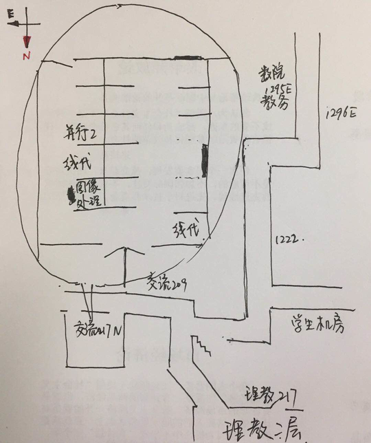

# 2018 并行计算

## 基本信息
- 本课程有课程微信群，用于发布即时通知。没入群的可联系群成员加群。
- 答疑：每周四早 8-10 点，地点：交流中心 217N。可在其他时间单独联系 TA。
**不会回复每天 22:00 以后提出的问题（包括作业 DDL 之前）。**  

## repo 用法
- 存放课程相关资料
  - `doc` 用于存放 pdf 文件。
  - `src` 用于存放源码。
  - 会用 git 的同学可自行建立 pull request 之后等我合并。不会用的同学可以直接
  发给助教，之后我来整理。
  - **请勿使用中文目录名和文件名！文件名中请勿使用空格！**
- 非即时提问交流请使用 [Issues](https://github.com/RyanBernX/par2018/issues)
功能（需要注册 github），大家可以互相讨论。
问题得到解决请自行 close issue。**在这里提出的技术相关问题助教必回。**
- 发布课程作业的相关信息。

## 课程作业 & 随堂讲义
相关内容请参考[项目 wiki](https://github.com/RyanBernX/par2018/wiki)。
