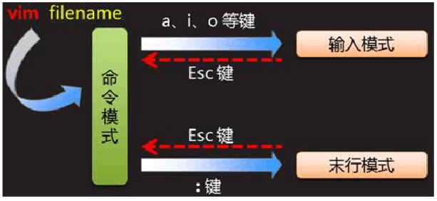
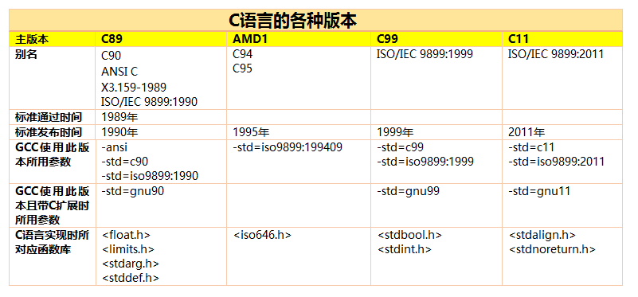

# Lecture 02

A brief introduction to Linux Programming: vim+gcc+ld+gdb

---

## 使用 Vim 编辑程序

[Vim](https://www.vim.org/) 是一个类似于 Vi 的著名的功能强大、高度可定制的文本编辑器，在 Vi 的基础上改进和增加了很多特性。
Vim 是自由软件， Windows 系统上可使用 GVim 。
它的最大特色是完全使用键盘命令进行编辑，脱离了鼠标操作虽然使得入门变得困难，但上手之后键盘流的各种巧妙组合操作却能带来极为大幅的效率提升。
因此 Vim 和现代的编辑器（如 Sublime Text）有着非常巨大的差异，而且入门学习曲线陡峭，需要记住很多按键组合和命令。 
Vim 拥有众多的插件可供选择，代码补全、语法高亮、配色方案、自动纠错、编译及错误跳转等方便编程的功能特别丰富，在程序员中被广泛使用，和 Emacs 并列成为类 Unix 系统用户最喜欢的文本编辑器。
Vim 的主要开发者是Bram Moolenarr ，现在我们每次启动 Vim 时，封面上会随机选择一种提示语展示(共有三种，如"帮助乌干达的可怜儿童!")。

vimtutor是个很好用的教程，对初学者非常友好，要使用它可在终端输入以下命令，然后在里面按提示操作即可(不用担心会破坏文件):

```
vimtutor
```

网上有人做了个 Vim 的游戏：[Game](https://vim-adventures.com/)。

### 启动和退出

默认启动 Vim 可用 `vim` 命令，启动后会显示 Vim 的首页，此时未打开任何文件。
用 `vim --noplugin` 可不带任何插件启动 Vim ，但 Vim的配置信息仍然是被加载的。

用 `vim -d` 或 `vimdiff` 命令可对两个文件进行比较和编辑，对比算法采用的是 LCS(Longest Common Subsequence)。

如果要打开多个文件，可以用 `vim file1 file2` 命令(文件数目可以大于两个，下同)，打开后可用 `:n` 和 `:N` 命令在各文件间跳转。
我们时常希望在各文件间进行一些剪切、复制和粘贴的操作，因此更推荐的一种方法是使用分割或者标签页。
用 `vim -o file1 file2` 命令对 file1 和 file2 上下分割，用 `vim -O file1 file2` 命令对 file1 和 file2 左右分割。
用 `vim -p file1 file2` 命令可将多个文件各自在标签页中打开，标签页间的跳转可用 `gt` 或者 `:n` 和 `:N` 命令。

**Ctrl-S是锁屏操作， Vim 中请不要用这个命令来保存文件。**

退出 Vim 请先回到命令模式(注意不要在插入模式下尝试退出)，然后输入 `:q` 命令即可退出。
如果打开了文件且文件发生修改，则需使用 `:wq` 或 `Shift+zz` 命令保存并退出，或者使用 `:q!` 强制退出(不保存文件)。
如果打开了多个文件，可以逐个退出(即先退出一个文件，再退出另一个……)，也可以使用 `:wqa` 或 `:qa!` 命令一次性退出。


### 模式转换

Vim 有以下几种模式：

- 正常（normal）模式，缺省的编辑模式；下面如果不加特殊说明，提到的命令都直接在正常模式下输入；任何其它模式中都可以通过键盘上的 Esc 键回到正常模式。
- 命令（command）模式，用于执行较长、较复杂的命令；在正常模式下输入“:”（一般命令）、“/”（正向搜索）或“?”（反向搜索）即可进入该模式；命令模式下的命令要输入回车键（Enter）才算完成。
- 插入（insert）模式，输入文本时使用；在正常模式下键入“i”（insert）或“a”（append）即可进入插入模式（也有另外一些命令，如“c”，也可以进入插入模式，但这些命令有其它的作用）。
- 替换（Replace）模式，按R键进入，和插入模式的不同之处在于替换模式下的编辑会直接覆盖文本。
- 可视（visual）模式，用于选定文本块；可以在正常模式下输入“v”（小写）来按字符选定，输入“V”（大写）来按行选定，或输入“Ctrl-V”来按方块选定。



**尽量在命令模式下操作，包括对文件的编辑！每当完成一个操作，要及时回到命令模式！**

敲下 `<ESC>` 键可以回到命令模式，或者使用 `CTRL-[` 组合命令，使用 `CTRL-O` 命令可以临时回到命令模式(然后你可以做一个操作如移动光标，之后会自动进入插入模式)。

打开文件时默认处于命令模式，要进入插入模式可用以下方法：

- i 在当前光标所在字符的前面，转为输入模式
- I  在当前光标所在行的行首，转换为输入模式
- a 在当前光标所在字符的后面，转为输入模式
- A 在当前光标所在行的行尾，转换为输入模式
- o 在当前光标所在行的下方，新建一行，并转为输入模式
- O 在当前光标所在行的上方，新建一行，并转为输入模式

### 快速移动

由于历史原因(或者确实有些道理)，Vim 选择`hjkl`作为方向键，分别表示左、下、上、右。
使用键盘上默认的方向键也是可以的，不过建议使用上面这种方式，因为不同键盘上方向键位置不固定，有些可能离主区域较远，来回移动比较麻烦。

**注意`hjkl`作为方向键不能在插入模式和替换模式下使用，但方向键可以。**

以下是一些常用的移动命令：

- 3j  向下移动3行，可换成其他数字（下同）
- 3k  向上移动3行
- 3h  向左移动3位
- 3l  向右移动3位
- gj 如果一行太长占用多个显示行，可用该命令向下移动一个显示行
- gk 如果一行太长占用多个显示行，可用该命令向上移动一个显示行
- Ctrl-U 内容下移半屏幕
- Ctrl-D 内容上移半屏幕
- Ctrl-f 内容向下移一屏幕
- Ctrl-b 内容上移一屏幕
- Ctrl-e 内容上移一行
- Ctrl-y 内容下移一行
- $ 移动光标到行尾
- 0 移动光标到行首
- ^ 移动光标到行首第一个非空格或tab的地方
- w 光标移到下一个单词的起始
- b 光标移到当前单词的起始
- e 光标移到当前单词的结尾
- 15G 定位到文件的第十五行
- gg 定位到文件的起始
- Shift+G 定位到文件的结尾
- Shift+H 光标移到当前屏幕的顶部
- Shift+M 光标移到当前屏幕的中间
- Shift+L 光标移到当前屏幕的底部
- gg=G 自动缩进整个文件
- % 光标移动到匹配的括号处
- `. 光标移动到上次编辑的位置
- zz 让光标所在的行居屏幕中央
- zt 让光标所在的行居屏幕最上一行
- zb 让光标所杂的行居屏幕最下一行

### 命令模式下的编辑

这里只介绍最基本的命令，

- x 删除一个字符
- r 替换一个字符，下一个输入的字符为替换后的字符
- cc 删除一行并进入插入模式，光标置于行首
- dd 删除整行
- d$ 删除光标所在字符到行尾的全部内容
- dG 删除当前行到文件末尾的所有行

### 复制和粘贴

复制和粘贴都是文本编辑中常用的操作，编程时更是如此，下面将介绍一些最常用的命令：

- yy 复制当前行的内容到剪贴板
- p 将剪贴板中内容粘贴在当前行的下方
- P 将剪贴板中内容粘贴在当前行的上方
- 10p 将剪贴板中的内容在当前行的下方连续粘贴十次

### 撤销和重做

Vim 中允许取消上一步的编辑，也允许重做上一步的编辑操作（即取消`u`的效果）。

- u 取消上一步的编辑操作

- ctrl-R 重做上一次的编辑操作，即取消`u`的效果

- . 将之前的编辑操作在当前的位置再次应用


### 拓展（不讲）

#### 选中和编辑

选中后可以上下左右移动，确定选中区域后可做其他编辑操作，如在连续十行代码的开头都插入某些字符。

- v 选中当前字符
- V 选中整行
- Ctrl-v 块选择，若干列若干行组成的矩阵

#### 搜索与替换

可以用到的时候再查：

- n,N 下一个，上一个
- /^text$
- /text\$\c
- ?text  反向搜索
- :%s/xxx/yyy/g  全文搜索与替换
- :s/xxx/yyy/g 当前行全部替换
- :s/xxx/yyy  当前行替换第一次
- :s/xxx/yyy/c
- :s/xxx/yyy/i
- :.,+2s/xxx/yyy/g
- :3,5s/xxx/yyy/g 第三行到第五行的区域内搜索并全部替换

#### 标记与跳转

标记是 Vim 中一个非常实用的功能，Vim 甚至可以在不同文件内标记与跳转：

- ma 在当前位置设置文件内的标签a
- mA 在当前位置设置全局的标签A
- 'a 跳转到标记a的位置的行首
- `a 跳转到具体标记的那个位置

#### 其他

- shift+j 合并两行
- ctrl-z  临时退出 Vim 回到终端
- fg 从终端回到先前的 Vim 界面

多重剪贴板通过寄存器实现：regs

- "3yy 将当前行的内容复制到3号寄存器
- "3p 将3号寄存器的内容粘贴到当前行的下方

插入模式下如何移动？ 最好就不要在插入模式下移动！

- 可以选择方向键
- 或者重映射快捷键
- 使用`Ctrl-O`临时进入正常模式

将系统剪切板的内容粘贴到 Vim 后格式会乱掉：
- `:set paste` 设置为粘贴模式

在 Vim 中输入中文的问题？  

- 在 Linux 上 Vim 处于 Normal 模式时就禁用中文输入法（如fcitx）

Vim 的配置文件

- .vimrc 用户的 Vim 配置文件
- .vim/  用户的 Vim 配置目录，可以放置插件等等

vim 的各种加强版本如 neovim， exvim 等等

vim 的各种插件(一般用 VimL 语言编写，来自官网或 GitHub)，如taglist YouCompleteMe Vundle插件管理器 等等

key mappings: 如ctrl与Caplocks互换，Escape和其下方紧邻的键互换。

书籍  Practical Vim 介绍了各种 Vim 技巧


---

## 使用 GCC 编译程序

如果没有`-o`和后面的参数，编译器默认生成的可执行文件是`a.out`。

```
 gcc -o run.exe -g -Wall -std=c99 -I./inc/ inc/list.c example.c -lm
```

上面的编译命令中，如果将`-lm`写在源文件前面，有时候会编译出错。这是因为`GCC`编译器对参数是顺序扫描的，必须先在源文件中遇到库调用的地方，然后才会去链接相应的库的函数。否则先扫描到`-lm`，但不知道具体链接到源文件的哪个位置，后面再扫描到源文件时想去链接，却已经没有链接库的选项了。

### C99 标准

C99 是继C89之后的第二个C语言官方标准，增加了很多新特性，其中一些如下：

- 增加了long long int和unsigned long long int类型
- 变量声明不必放在语句块的开头，比如可以直接在for循环中声明循环变量
- 预编译处理增强了，比如支持了可变参数的宏
- 对编译器限制增加了，比如源程序中要求至少支持到4095字节，变量名和函数名的要求至少支持到63字节（extern要求支持到31）

在老版本的GCC里面，比如gcc 4.8.2中，要使编译时按照C99的规范，应该加入`-std=c99`选项。



### 编译选项

一些常用的编译选项列举如下：

- -g  指示编译器，在编译的时候，产生调试信息
- -L 指定编译和运行的时候，搜索链接库的路径
- -I 指定链接库的头文件的路径
- -l 指定链接库的简称，如数学库 `-lm`
- -D 相当于C语言里面的宏定义
- -Wall 会打开一些很有用的警告选项，建议编译时加此选项
- -std 指定C标准，如-std=c99使用c99标准，-std=gnu99则表示使用C99 再加上 GNU 的一些扩展

### 编译过程

介绍编译的四个阶段，每个阶段的输出需要展示出来。


#### 预处理(Preprocessing)

使用预处理器cpp，将所有的#include头文件以及宏定义替换成其真正的内容，预处理之后得到的仍然是文本文件，但文件体积会大很多。

```
cpp example.c -I./inc -o example.i
```

这里也可以用`gcc -E`控制编译进度，预处理后可以对比文件大小和代码行数。
打开后可以发现所有的注释都被删除了，宏的名字也已经找不到了，使用到宏的地方会把宏全部替换为具体的数值。
 
#### 编译(Compilation)

使用编译器gcc，将经过预处理之后的程序转换成特定汇编代码(assembly code)的过程。
```
gcc -S -std=c99 -I./inc example.c -o example.s
```

上述命令中`-S`让编译器在编译之后停止，不进行后续过程。
编译过程完成后，将生成程序的汇编代码`example.s`，这也是文本文件。
打开后可以发现汇编代码中都是分段的，所有的C语句都已经转换成了汇编语句，如`movl`，`addl`，`jmp`等等。

#### 汇编(Assemble)

使用汇编器as，将上一步的汇编代码转换成机器码(machine code)，这一步产生的文件叫做目标文件，是二进制格式。

```
as -I./inc example.s -o example.o
```

也可以用`gcc -c`来控制，这一步需要为每一个源文件产生一个目标文件，所以我们进入`inc`目录后运行：
```
gcc -c list.c -o list.o
```

完成后可以用`file`命令来查看目标文件的格式，它们都是ELF格式，但是还不能执行。
如果要用 Vim 来查看目标文件，应如下操作

```
vim -b example.o 以二进制模式打开
:%!xxd -g 1      切换到十六进制模式显示
```

#### 链接(Linking)

使用链接器ld，将多个目标文以及所需的库文件(.so等)链接成最终的可执行文件(executable file)。

```
ld -o run.exe example.o inc/list.o -lc -lm 
```

上面这个命令可以生成可执行文件，但运行时会报错。
使用`gcc -v`可以看到在最后一段的输出中，需要链接很多库才最终生成可执行文件。
对于动态库，编译时只是指明链接的库和位置，真正执行时才会去调用相应的库。

**编译之后的可执行文件并不是一个真正可独立运行的程序，它还要依赖于libc等动态库，还要依赖于操作系统的内核才能运行。**

### 拓展（不讲）

源程序引用库A，库A引用库B，编译时链接顺序应是`-lA -lB`

多个链接库相互引用，如何编译？(-lA -lB -lA)
对于这种循环依赖问题，也可以用`-Wl,--start-group -lA -lB -Wl,--end-group`[这种方法](http://blog.sina.com.cn/s/blog_a9303fd90101cy5y.html)。
推荐查阅[GCC官方文档](https://gcc.gnu.org/onlinedocs/gcc-4.8.5/gcc/Link-Options.html#Link-Options)，请选择相应的版本对应的文档。

复杂的编译命令可写在 Makefile 中

C11和C14标准

优化选项：O0 O1 O2 O3 Os。发行时一般用 O2 或 O3 ，O3选项据称有一定风险。

---

## Linux 上程序的运行

假设我们在src/gcc目录下运行下面这个程序，那么工作目录就是src/gcc。
如果我们是在src/目录下以`gcc/run.exe`运行这个程序，那么工作目录就是src/。
**如果程序中要使用相对位置，那么基准是工作目录，而非源程序本身的位置！**

```
./run.exe > ans.txt
```
下面三个命令可以对`run.exe`做些分析：

- file run.exe 查看文件格式
- nm run.exe  列出文件中的符号
- ldd run.exe 查看依赖的库文件
- readelf -d run.exe 查看头部信息(也可用来查看链接库的头部信息)

可以发现`libc.so.6`这个动态库，用`locate libc.so.6`可以找到其位置，再用`ls -l`命令可以发现它是一个软链接以及链接到的位置。
Linux 上通过这种方式，来解决库版本依赖的问题，更换库版本时只要修改软链接的指向即可。

### 环境变量

默认的GNU加载器`ld.so`，按以下顺序搜索库文件：

- 首先搜索程序中`DT_RPATH`区域（不建议使用），除非还有`DT_RUNPATH`区域。
- 其次搜索`LD_LIBRARY_PATH`。如果程序是`setuid/setgid`，出于安全考虑会跳过这步。
- 搜索`DT_RUNPATH`区域(`DT_RPATH`会传递给当前目标的所有children，但这个选项只针对当前目标自身)。
- 搜索缓存文件`/etc/ld.so.cache`（停用该步请使用'-z nodeflib'加载器参数）
- 搜索默认目录`/lib`，然后`/usr/lib`（停用该步请使用'-z nodeflib'加载器参数）

上面的顺序可通过`man ld.so`命令查看。
如果是想让链接库的配置对所有用户可用，可以直接修改`/etc/ld.so.conf`然后使用`ldconfig -v`更新缓存文件(需要sudo权限)。
或者也可以把库文件直接移入`/lib`或`/usr/lib`，但不建议这样做。
下面是一些使用示例，用`-Wl`来表示将后面的参数传给链接器，注意中间不要加空格。

```
gcc -o run.exe -Wall -std=c99 example.c -I./inc -L./inc -lm -llist
echo $LD_LIBRARY_PATH
export LD_LIBRARY_PATH=${YOUR_PATH}:$LD_LIBRARY_PATH
echo $LD_LIBRARY_PATH
unset LD_LIBRARY_PATH
gcc -o run.exe -Wall -std=c99 example.c -I./inc -L./inc -lm -llist -Wl,--rpath=./inc/
gcc -o run.exe -Wall -std=c99 example.c -I./inc -L./inc -lm -llist -Wl,--rpath=./inc/,--enable-new-dtags 
```

上面的`DT_RPATH`和`DT_RUNPATH`中，都是使用相对路径，这在当前目录执行程序是没有问题的。
但如果切换到其他目录来执行这个程序，依然会提示找不到动态库。
因此在真正发行软件时，一般会用`--prefix`来指定安装的绝对路径，在编译时将相应的绝对路径直接加在可执行程序中，保证运行时链接动态库不会出问题。
`LD_LIBRARY_PATH`则一般用于在开发测试时临时使用，设置较为灵活。

<!-- Some bugs may exist -->
<!-- https://blog.csdn.net/dbzhang800/article/details/6918413 -->
<!-- http://blog.qt.io/blog/2011/10/28/rpath-and-runpath/ -->

### Linux 上的运行库

在 linux 下开发软件时，完全不使用第三方函数库的情况是比较少见的，通常来讲都需要借助一个或多个函数库的支持才能够完成相应的功能。
从程序员的角度看，函数库实际上就是一些头文件（ .h ）和库文件（ .so 或者 .a ）的集合。虽然 Linux 下的大多数函数都默认将头文件放到/usr/include/ 目录下，而库文件则放到 /usr/lib/ 目录下，但并不是所有的情况都是这样。

值得好好解释一下的是 `-l` 选项，它指示 GCC 去连接库文件 libm.so 。 
Linux 下的库文件在命名时有一个约定，那就是应该以lib 三个字母开头.
由于所有的库文件都遵循了同样的规范，因此在用-l 选项指定链接的库文件名时可以省去lib 三个字母。
也就是说GCC 在对-lm 进行处理时，会自动去链接名为libm.so的库 。

Linux 下的库文件分为两大类分别是动态链接库（通常以.so 结尾）和静态链接库（通常以.a 结尾），两者的差别仅在程序执行时所需的代码是在运行时动态加载的，还是在编译时静态加载（直接打包到可执行文件中）的 。
默认情况下，GCC 在链接时优先使用动态链接库，只有当动态链接库不存在时才考虑使用静态链接库，如果需要的话可以在编译时加上`-static` 选项，强制使用静态链接库。
例如，如果在inc 目录下有链接时所需要的库文件liblist.so 和liblist.a ，为了让GCC 在链接时只用到静态链接库，可以使用下面的命令（这要求链接到的其他系统库也要安装好相应的静态库版本）：

```
gcc -o run.exe -std=c99 example.c -static -I./inc -L./inc -llist -lm

```

静态库之所以成为【静态库】，是因为在链接阶段，会将汇编生成的目标文件.o与引用到的库一起链接打包到可执行文件中。因此对应的链接方式称为静态链接。
其实一个静态库可以简单看成是一组目标文件（.o/.obj文件）的集合，即很多目标文件经过压缩打包后形成的一个文件。静态库特点总结：

-  静态库对函数库的链接是放在编译时期完成的
-  程序在运行时与函数库再无瓜葛，移植方便
-  浪费空间和资源，因为所有相关的目标文件与牵涉到的函数库被链接合成一个可执行文件
- 静态库对程序的更新、部署和发布页会带来麻烦。如果静态库liba.lib更新了，所以使用它的应用程序都需要重新编译、发布给用户

```
ar crv inc/liblist.a inc/list.o
```

动态库在程序编译时并不会被连接到目标代码中，而是在程序运行是才被载入。不同的应用程序如果调用相同的库，那么在内存里只需要有一份该共享库的实例，规避了空间浪费问题。动态库在程序运行是才被载入，也解决了静态库对程序的更新、部署和发布页会带来麻烦。用户只需要更新动态库即可，增量更新。
动态库特点总结：

- 动态库把对一些库函数的链接载入推迟到程序运行的时期
- 可以实现进程之间的资源共享。（因此动态库也称为共享库）
- 将一些程序升级变得简单。
- 甚至可以真正做到链接载入完全由程序员在程序代码中控制（显示调用）

```
 gcc -o inc/liblist.so -Wall --shared -fpic inc/list.c
```

### 拓展（不讲）

书籍  链接、装载与库

书籍 深入理解计算机系统  (推荐英文版本)

[linux三种方式使用库：静态链接库，动态链接库，动态加载库](https://blog.csdn.net/u014132659/article/details/52252298)

---

## 使用 GDB 来调试

首先用 `gcc -g`选项（加入调试信息） 编译并取消一切优化选项（避免代码流程改变）。

### 启动和退出

```
gdb run.exe    进入gdb，对一个可执行文件调试
gdb            或者先启动gdb
file run.exe   再导入一个可执行文件的符号
quit           退出gdb
Ctrl-D         用这种方式也可以
```


### 基本使用

#### 用 list 列出源代码

- list  列出一部分代码，可重复使用
- help list  查看用法
- list 10   以第10行为中心显示
- list addResult  显示addResult函数
- list 10,15   列出10-15行的源代码
- list list.h:15  列出其他文件的相应行
- list list.c:addResult

#### 运行程序

- run  运行程序
- run arg  可以加上参数

#### 使用断点

- break 7   在某行设置断点
- break addResult  在某个函数设置断点
- break list.h:15  在其他文件的某行设置断点
- break list.h:addResult 在其他文件的某个函数设置断点
- info break  查看断点信息
- break 8 if a == 10  条件断点
- disable 断点号     关闭断点
- enable 断点号     开启断点
- enable once  断点号   开启一次
- enable delete  断点号  开启一次后删除
- delete 断点号   删除断点
- clear  清除当前行的断点

#### 流程控制

- continue 当执行到某处中断时，使其继续执行
- next  单步执行不进入函数
- step 单步执行进入函数
- kill 终止正在调试的程序

#### 监控变量

这里只介绍最基本的用法：

- print a  在运行时打印变量的值
-   print/F expression  其中F为格式（x--16进制,d--有符号十进制,u--无符号十进制,f--浮点格式）
-   watch a  监控哪些值在运行时被改变了
-   set variable=value  修改变量的值

#### info命令

- info break  查看断点信息
- info args  查看当前方法的参数
- info stack查看调用堆栈
- info source查看当前源文件的信息
- info sources查看所有在程序中的源文件路径

#### 查看内存

一般来说，GDB会根据变量的类型输出变量的值，但你也可以自定义GDB的输出的格式。
例如，你想输出一个整数的十六进制，或是二进制来查看这个整型变量的中的位的情况。要做到这样，你可以使用GDB的数据显示格式：

- x 按十六进制格式显示变量。
- d 按十进制格式显示变量。
- u 按十六进制格式显示无符号整型。
- o 按八进制格式显示变量。
- t 按二进制格式显示变量。
- a 按十六进制格式显示变量。
- c 按字符格式显示变量。
- f 按浮点数格式显示变量。

`x/<n/f/u> <addr>`   n、f、u是可选的参数。<addr>表示一个内存地址。
n 是一个正整数，表示显示内存的长度，也就是说从当前地址向后显示几个地址的内容。
f 表示显示的格式，参见上面。如果地址所指的是字符串，那么格式可以是s，如果地址是指令地址，那么格式可以是i。
u 表示从当前地址往后请求的字节数，如果不指定的话，GDB默认是4个bytes。u参数可以用下面的字符来代替，b表示单字节，h表示双字节，w表示四字节，g表示八字节。当我们指定了字节长度后，GDB会从指内存定的内存地址开始，读写指定字节，并把其当作一个值取出来。
比如`x/4dw 0xbffff650`指的是显示4个单元的内容，以10进制显示，每个单元长度为4个字节。

### 拓展（不讲）

#### Valgrind

很好用的内存错误调试工具，可用包管理器直接安装。
有时候程序运行没报错，但其实存在对内存的非法访问(这种情况在数据量足够大时就会报错)，用GDB也不一定能调出来，但用Valgrind可以检测出来。
Valgrind 可能存在误报的情况(没有问题却报告有问题)，但只要程序中有对内存的非法访问就一定能检测到，是一个非常实用的辅助工具。
缺点是该工具占用内存较大，如果某些错误只有在数据量极大(逼近内存容量)时才能复现，那么很难用这个工具调试。

生产实践中大型的项目，都有完善的日志机制，通过分析日志就可以快速地定位并解决问题。

#### visual studio 2017 远程调试功能

需要安装`gdbserver`, 使用方法参考 [HELP](https://www.cnblogs.com/xylc/p/6533716.html?&from=androidqq)。

#### GDB 调试多线程与多进程

#### Unix 环境高级编程

---

